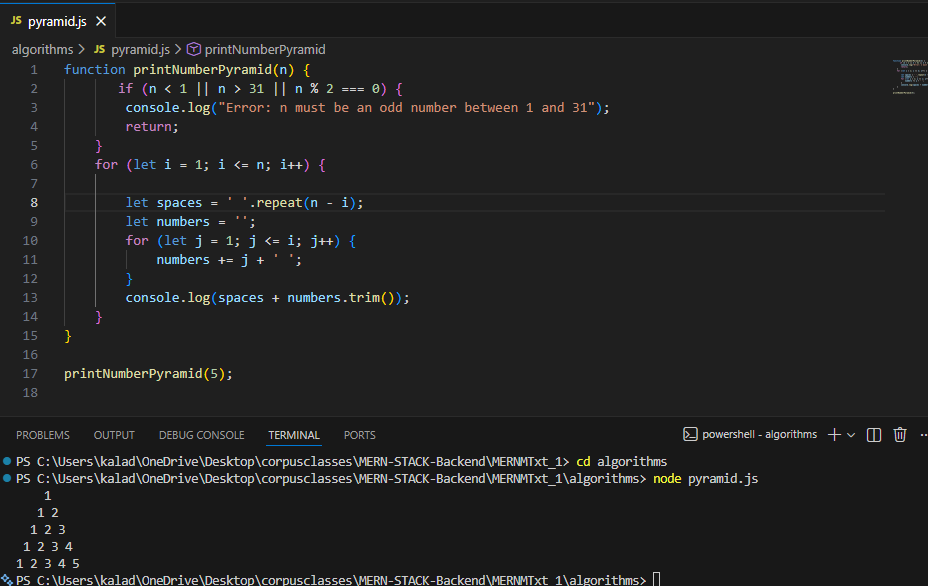

# Arrays in Range [1..n] – Missing & Duplicate Numbers

## Problem
Given an array of integers where:
- Length of array = n
- Each number is in the range [1, n]
- Some numbers appear twice
- Some numbers are missing

Find:
- All missing numbers
- All duplicate numbers

## Constraints
- Time Complexity: O(n)
- Extra Space: O(1) (excluding result arrays)

## Approach
We use index-based negative marking:
- For each number x, mark index x-1 as visited
- If already marked → duplicate
- After traversal, indexes with positive values indicate missing numbers

## Sample Input
```js
[4, 3, 2, 7, 8, 2, 3, 1]


## second ques pyramid.js


