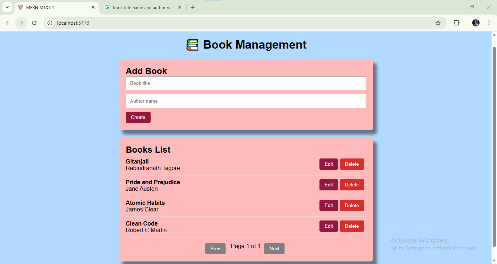
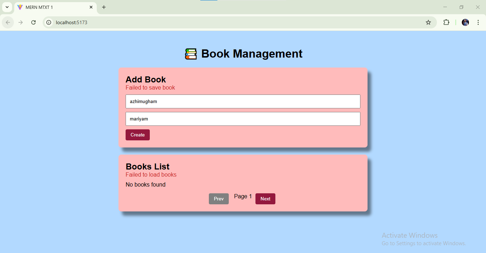

# Books CRUD Frontend

This is the **frontend** for the Books CRUD application built with **React** and **Vite**. It connects to a backend API to manage books and provides a user-friendly interface for listing, adding, editing, and deleting books.

## Features

- **Pages**
  - `BooksList` – Display all books with pagination
  - `BookForm` – Add or edit a book
- **CRUD Operations**
  - Create new books
  - Read/list all books
  - Update book details
  - Delete books
- **Pagination** – Navigate through large lists of books
- **Validation** – Form validation for required fields
- **Loading & Error States** – Proper feedback during API calls
- **Responsive UI** – Works on desktop and mobile

## Tech Stack

- React 18
- Vite
- Axios (for API calls)
- React Router (for routing between pages)
- Tailwind CSS (or any preferred styling)
- Optional: Any UI library for better UI components

## Project Structure

src/
├── api/ # API calls using Axios
│ └── bookApi.js
├── components/ # Reusable components
│ └── Pagination.jsx
├── pages/
│ ├── BooksList.jsx
│ └── BookForm.jsx
├── App.jsx # App routes
├── main.jsx # Entry point
└── index.css # Global styles

bash
Copy code

## Installation

1. Clone the repository:

git clone <frontend-repo-url>
cd frontend
Install dependencies:

Copy code
npm install
Create .env file with the backend API URL:

env
Copy code
VITE_API_URL=http://localhost:5000/api/books
Start the development server:

Copy code
npm run dev
Open http://localhost:5173 in your browser.

Usage
Navigate to / to see the list of books.

Use Add Book button to create a new book.

Edit or delete books using respective buttons in the list.

Pagination controls appear at the bottom of the list for navigation.

Notes
Ensure the backend API is running before using the frontend.

All forms include basic validation and proper error handling.

Loading spinners and error messages provide feedback during API operations.

