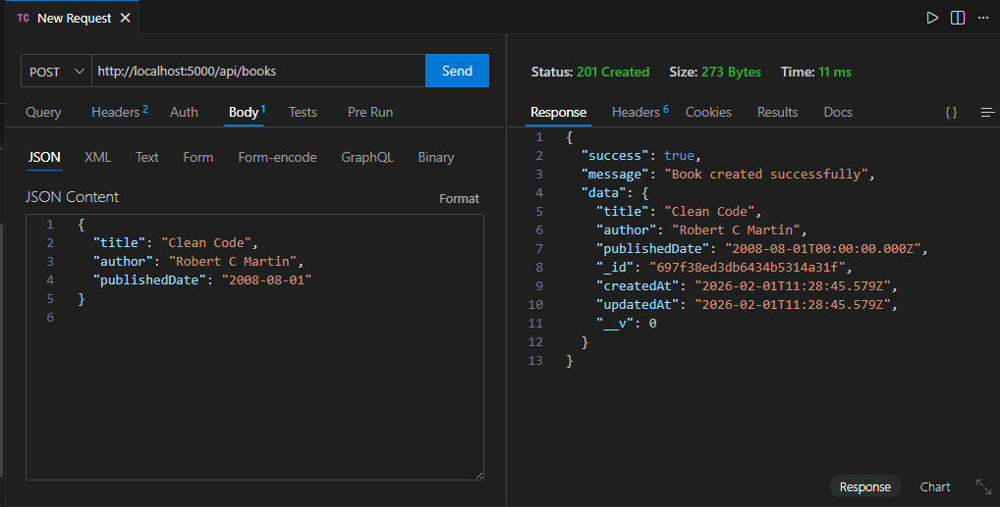
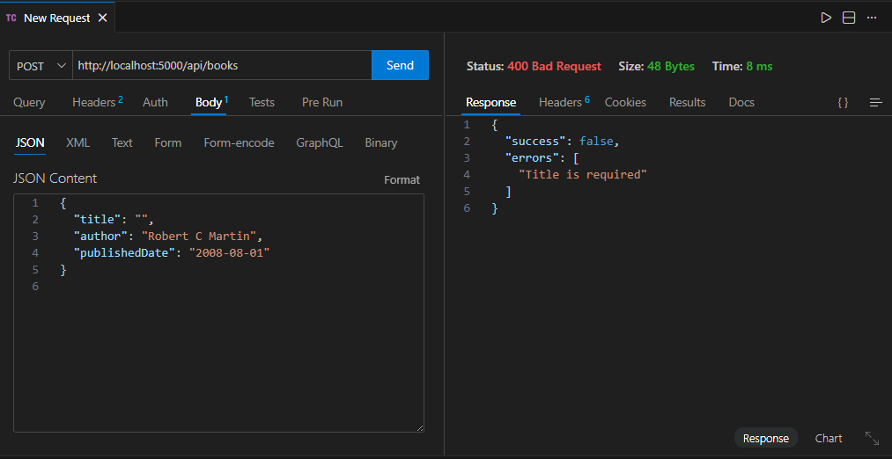
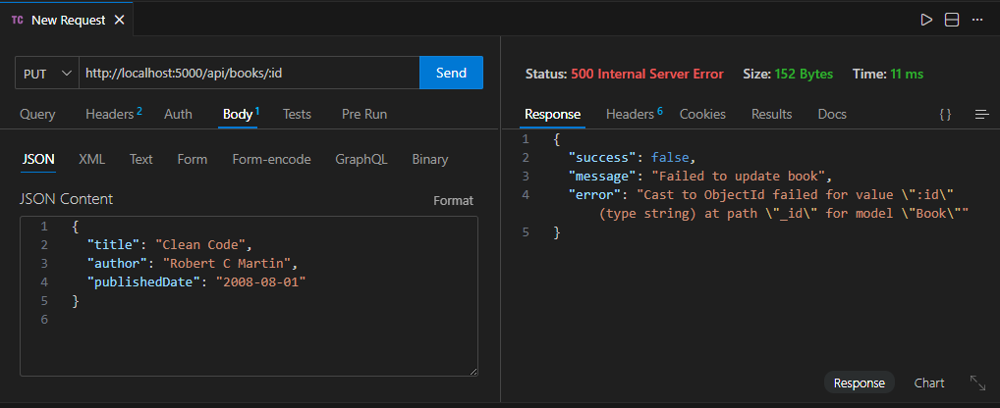
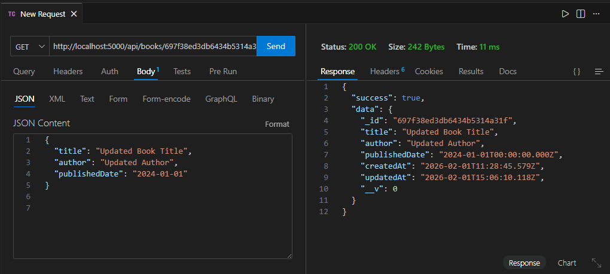
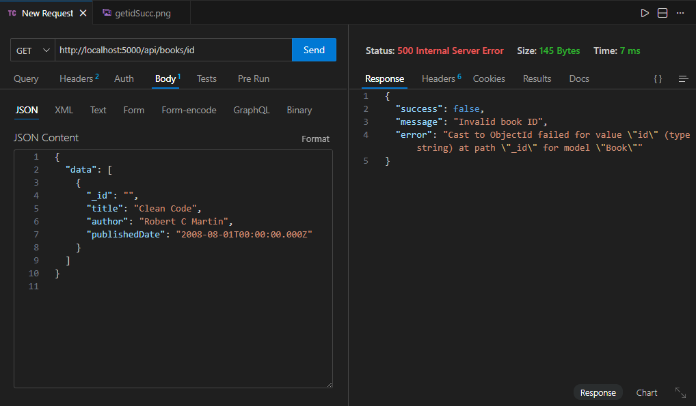
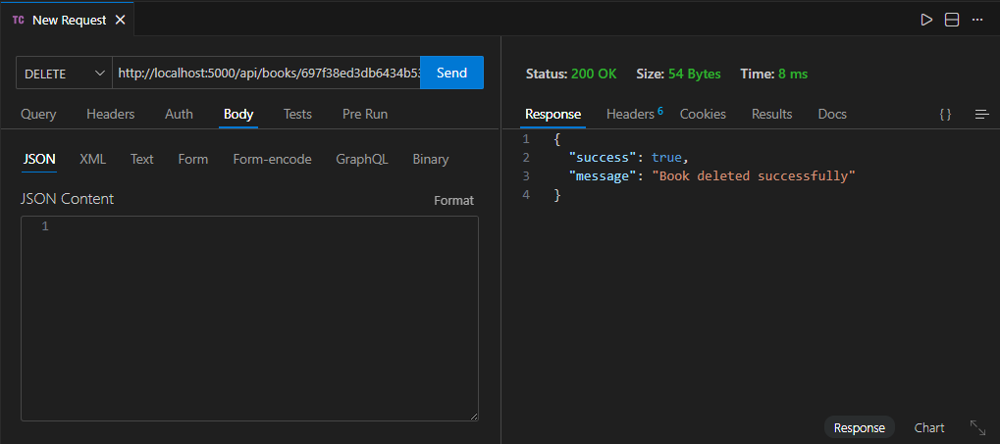
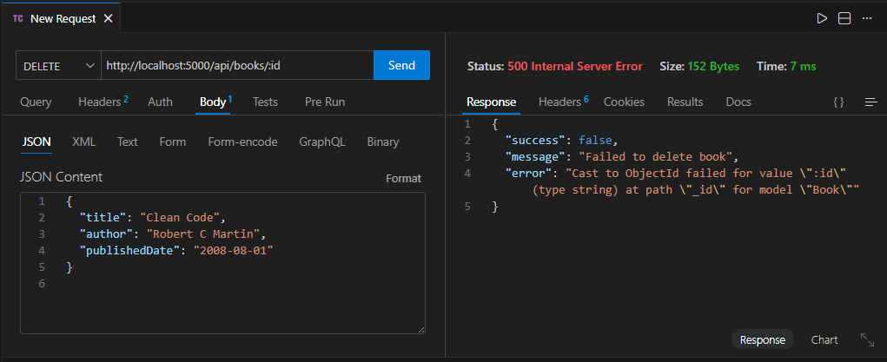
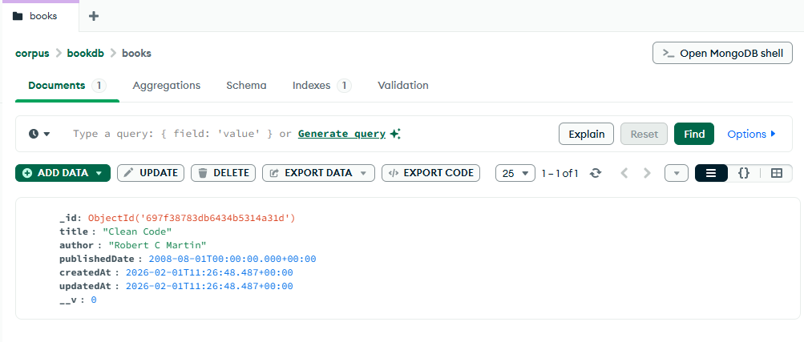

# Books CRUD Backend

This is the **backend** for the Books CRUD application built with **Node.js**, **Express**, and **MongoDB**. It provides RESTful APIs for managing books with full CRUD operations.

## Features

- **Book Model**
  - `title` (String, required)
  - `author` (String, required)
  - `publishedDate` (Date, optional)
  - `createdAt` (Date, auto-generated)
- **CRUD APIs**
  - `GET /api/books` – List all books with pagination
  - `POST /api/books` – Create a new book
  - `GET /api/books/:id` – Get a book by ID
  - `PUT /api/books/:id` – Update a book
  - `DELETE /api/books/:id` – Delete a book
- **Validation**
  - Required fields checked using `express-validator`
  - Clear and user-friendly error messages
- **Centralized Error Handling**
- **Environment Variables**
  - Configured via `.env` file
- **Testing**
  - APIs tested using Thunder Client or Postman
- **Pagination**
  - Supports page and limit query parameters for efficient listing

## Tech Stack

- Node.js
- Express.js
- MongoDB (Atlas or Local)
- Mongoose
- Express Validator
- dotenv
- Cors
- Optional: Nodemon for development

## Project Structure

backend/
├── controllers/ # Controller functions for API endpoints
│ └── bookController.js
├── models/ # Mongoose models
│ └── Book.js
├── routes/ # API routes
│ └── bookRoutes.js
├── middlewares/ # Custom middlewares
│ ├── errorHandler.js
│ └── validateRequest.js
├── config/
│ └── db.js # MongoDB connection
├── .env.sample # Sample environment variables
├── server.js # Entry point
└── package.json

bash
Copy code

## Installation

1. Clone the repository:

git clone <backend-repo-url>
cd backend
Install dependencies:

Copy code
npm install
Create .env file (based on .env.sample) with your MongoDB URI:

env
Copy code
MONGO_URI=mongodb://localhost:27017/booksdb
PORT=5000
Start the server:

Copy code
npm run dev
The server will run at http://localhost:5000.

API Endpoints
Method	Endpoint	Description
GET	/api/books	Get all books (supports pagination)
POST	/api/books	Create a new book
GET	/api/books/:id	Get a book by ID
PUT	/api/books/:id	Update a book
DELETE	/api/books/:id	Delete a book

Pagination
Query parameters for listing books:

page – Current page number (default: 1)

limit – Number of books per page (default: 10)

Copy code
GET /api/books?page=2&limit=5

Notes
Ensure MongoDB is running locally or provide a valid Atlas URI.

All requests are validated with proper error messages.

Use Thunder Client or Postman to test APIs.

Centralized error handling ensures consistent error responses.

